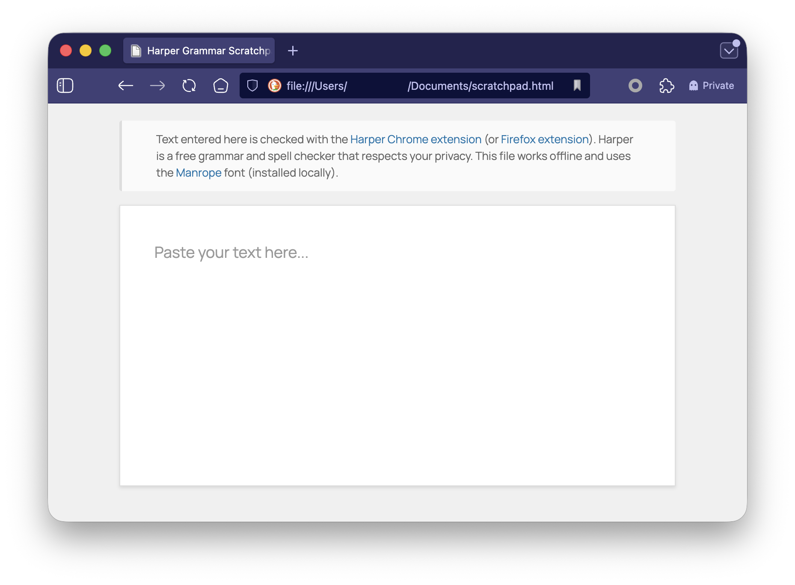

# Lightweight Scratchpad for Harper

Single HTML file for grammar checking text from apps that don't support [Harper](https://writewithharper.com) natively.

## What This Solves

Harper supports [tons of apps](https://writewithharper.com)—[Obsidian](https://obsidian.md), [VS Code](https://code.visualstudio.com/), [Neovim](https://neovim.io/), [Chromium-based browsers](https://en.wikipedia.org/wiki/Chromium_(web_browser)#Browsers_based_on_Chromium), [Firefox](https://www.firefox.com/), and more. But some apps will never get Harper support: [BBEdit](https://www.barebones.com/products/bbedit/index.html), [Things](https://culturedcode.com/things/), [Day One](https://dayoneapp.com), [Mail.app](https://support.apple.com/mail), or anything without plugin architecture.

**My use case:** I draft in BBEdit, track tasks in Things, and journal in Day One. None of them support Harper. I wanted grammar checking without relying on heavier tools like [LanguageTool](https://languagetool.org) or [Grammarly](https://www.grammarly.com).

## What This Is

One HTML file that works with [Harper's Chrome extension](https://chromewebstore.google.com/detail/private-grammar-checking/lodbfhdipoipcjmlebjbgmmgekckhpfb) (or [Firefox extension](https://addons.mozilla.org/en-US/firefox/addon/private-grammar-checker-harper/)). Copy from your app, paste here, let Harper check it, copy back. Done.

**Why not just use Harper's homepage?**
- **Lightweight:** Typically uses ~10x less memory than Harper's homepage
- **Works offline:** Zero network requests (verified via Developer Tools)
- **Plain text only:** Preserves [Markdown](https://daringfireball.net/projects/markdown/) syntax—no rich text formatting
- **Disposable:** Text clears on refresh

## Screenshot

## Setup

1. Download [Manrope](https://fonts.google.com/specimen/Manrope) and install it (via Font Book on macOS, or your system's font installer).
2. Install [Harper's Chrome extension](https://chromewebstore.google.com/detail/private-grammar-checking/lodbfhdipoipcjmlebjbgmmgekckhpfb) or [Firefox extension](https://addons.mozilla.org/en-US/firefox/addon/private-grammar-checker-harper/).
3. **For Chrome:** Enable "Allow access to file URLs" in the extension settings (required for local files).
4. In Harper's extension settings, check **"Enable on New Sites by Default"** (required for local files).
5. Download [`scratchpad.html`](https://raw.githubusercontent.com/bryanvillarin/lightweight-scratchpad-for-harper/main/scratchpad.html) and save somewhere convenient.
6. Bookmark it for quick access.

## How to Use

1. Draft in BBEdit, Things, Day One, Mail, whatever.
2. Copy text.
3. Open scratchpad.
4. Paste, let Harper check.
5. Fix issues.
6. Copy back.

Refresh clears the text. Disposable by design—your source of truth lives in your app, not here.

## Speed Comparison

From [Harper's homepage](https://writewithharper.com):
- **Harper:** 10 ms
- **LanguageTool:** 650 ms
- **Grammarly:** 4000 ms

Harper is 65x faster than LanguageTool, 400x faster than Grammarly.

## Support

This is a personal tool I'm sharing. Use as-is or fork it. No active maintenance. No feature requests.

For Harper questions, see [Harper's docs](https://writewithharper.com/docs/about).

## License

[MIT License](https://github.com/bryanvillarin/lightweight-scratchpad-for-harper/blob/main/LICENSE) — use it, modify it, share it.

---

* **Bryan Villarin**  
* [bryanvillarin.link](https://bryanvillarin.link) · [allnarfedup.blog](https://allnarfedup.blog)